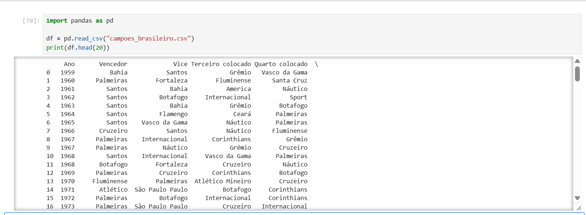
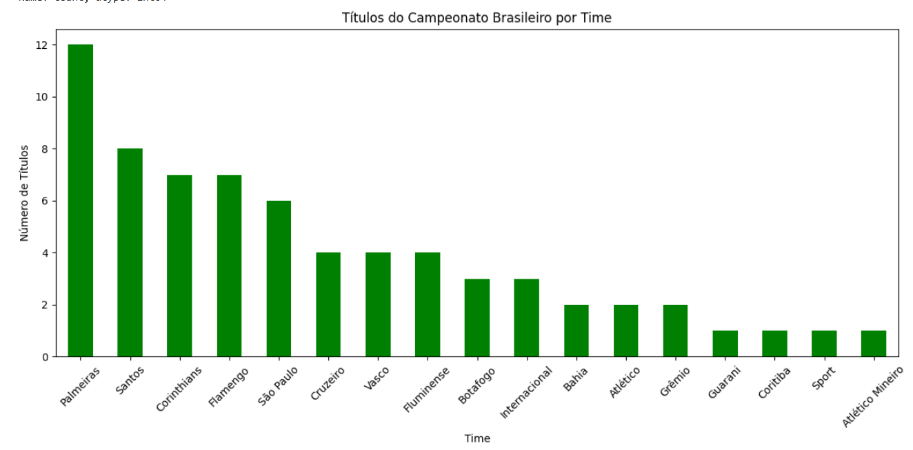
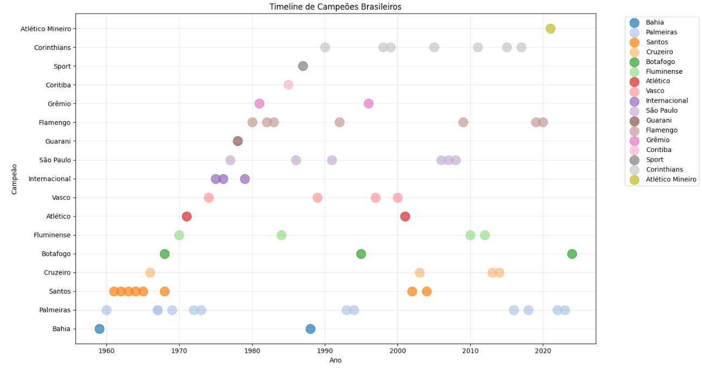

# 📊 Análise dos Campeões do Campeonato Brasileiro

Este projeto realiza uma análise exploratória dos campeões do **Campeonato Brasileiro de Futebol**, utilizando **Python, Pandas e Matplotlib** para gerar insights e visualizações.

---

## 🚀 Objetivos
- Carregar e organizar os dados históricos de campeões.
- Analisar a distribuição de títulos entre os clubes.
- Visualizar a linha do tempo das conquistas para identificar períodos de domínio.

---

## 🛠️ Tecnologias Utilizadas
- **Python 3**
- **Jupyter Notebook**
- **Pandas** → Manipulação de dados.
- **Matplotlib** → Criação de gráficos.

---

## 📂 Estrutura do Projeto

```
analise-campeoes-brasileiros/
│-- analise_campeoes.ipynb    # Notebook principal com o código
│-- campeoes.csv               # Dataset com os campeões
│-- README.md                  # Documentação do projeto
│-- img/                       # Pasta com imagens de exemplo
│   ├-- UM.png
│   ├-- DOIS.png
│   └-- TRES.png
│-- requirements.txt           # (opcional) dependências: pandas, matplotlib
│-- .gitignore                 # (opcional) para não subir arquivos temporários
```

---

## ▶️ Como Executar

1. Clone este repositório:
```bash
git clone https://github.com/CarlosLacerda/analise-campeoes-brasileiros.git
cd analise-campeoes-brasileiros
```

2. (Recomendado) crie um ambiente virtual:
```bash
python -m venv venv
source venv/bin/activate   # Linux/Mac
venv\Scripts\activate      # Windows
```

3. Instale as dependências:
```bash
pip install -r requirements.txt
# ou, se não houver requirements:
pip install pandas matplotlib
```

4. Abra o Jupyter Notebook:
```bash
jupyter notebook
```

5. No navegador, abra `analise_campeoes.ipynb` e execute as células.

---

## 📈 Análises Realizadas

1. **Carregamento dos dados**  
   Leitura do dataset em formato CSV com os campeões do Brasileirão.
   
   

2. **Contagem de títulos por time (Gráfico de Barras)**  
   Mostra o ranking de títulos de cada clube.
   
   

3. **Linha do tempo dos campeões (Timeline)**  
   Visualiza em quais anos cada time foi campeão, destacando "eras de domínio".
   
   

---

## 📌 Exemplo de Resultados
- Ranking de títulos por clube (gráfico de barras)
- Linha do tempo das conquistas (timeline) com cores por time
- Observações rápidas e insights finais

---

## 📜 Licença
Este projeto é de uso educacional e livre.

---

## 👨‍💻 Autor
**Carlos Lacerda**  
[GitHub](https://github.com/CarlosLacerda) | [LinkedIn](https://linkedin.com/in/seu-perfil)

---
